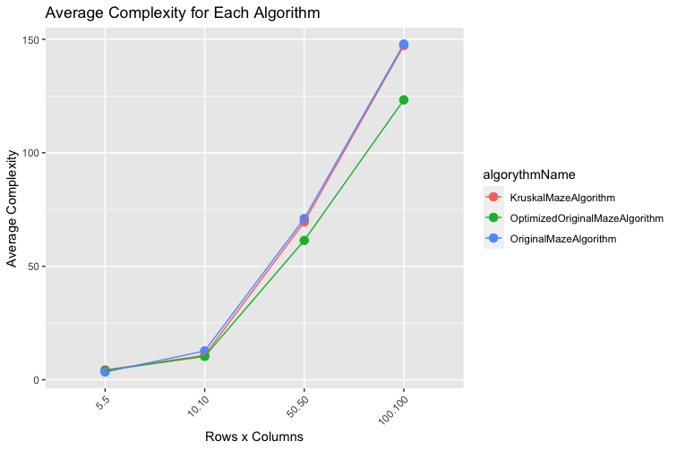

# Kata Maze

## Functional
Generate random mazes

## Notice
Refactor as much as possible


+---+---+---+---+---+---+---+
|                           |
+---+   +   +   +---+   +   +
|       |   |   |       |   |
+---+---+---+---+---+---+   +
|                           |
+---+   +   +   +---+---+   +
|       |   |   |           |
+   +---+   +---+   +   +   +
|   |       |       |   |   |
+   +---+   +   +---+---+   +
|   |       |   |           |
+   +   +---+---+---+   +   +
|   |   |               |   |
+---+---+---+---+---+---+---+


# Kata Maze

## Approach

1. Play with the existing.
2. How do we make sure the existing works?
3. What is important in a labyrinth generation ? 
4. How to mesure labyrinth generation algorithm performance?
4. Refactor existing code to make it maintanable.
5. Optimisation of existing code.
6. Add a popular algorithm implementation
7. Generate random mazes using different algorithms and collect metrics.
8. Benchmark algorithm using metrics


## Functional

## Algorithms
This project implements three different maze generation algorithms:
1. **OriginalMazeAlgorithm**
2. **OptimizedOriginalMazeAlgorithm**
3. **KruskalMazeAlgorithm**

You can add an algorithm by extending [MazeALgorithm](/src/main/java/fr/maze/original/MazeAlgorithm.java) and implementing all required methods.

### OriginalMazeAlgorithm
The `OriginalMazeAlgorithm` uses a simple method to generate a maze by randomly connecting each cell to one of its north or east neighbors.

#### Complexity
- **Time Complexity**: `O(rows * columns)`
- **Space Complexity**: `O(rows * columns)`

### OptimizedOriginalMazeAlgorithm
The `OptimizedOriginalMazeAlgorithm` improves upon the `OriginalMazeAlgorithm` by considering all four possible neighbors (north, south, east, west) when generating the maze, reducing directional bias.

#### Complexity
- **Time Complexity**: `O(rows * columns)`
- **Space Complexity**: `O(rows * columns)`

### KruskalMazeAlgorithm
The `KruskalMazeAlgorithm` uses Kruskal's algorithm to generate a maze. It ensures that the maze is fully connected and contains no cycles, resulting in a perfect maze.

#### Complexity
- **Time Complexity**: `O((rows * columns) log (rows * columns))`
- **Space Complexity**: `O(rows * columns)`


## How to Run

To run the `main()` method and generate mazes using the different algorithms, follow these steps:

1. **Compile the Project**:
   ```sh
   mvn clean compile
   ```

2. **Run it**


   ```sh
   mvn exec:java -Dexec.mainClass="fr.maze.original.Main" -Dexec.args="10 metrics.json"
   ```
    * The first argument (10) specifies the number of iterations.
    * The second argument (metrics.json) specifies the output file for the metrics.

# Benchmark analysis

Using R script, we can generate plot to see the performance of each algorithm based on the different metrics.

   ```sh
  Rscript algo_summary_benchmark.R /path/to/your/metrics.json (default is metrics.json)
   ```

## Benchmark Results

Below are the benchmark results for the different maze generation algorithms:

#### Execution Time


#### Complexity



#### Memory Usage

